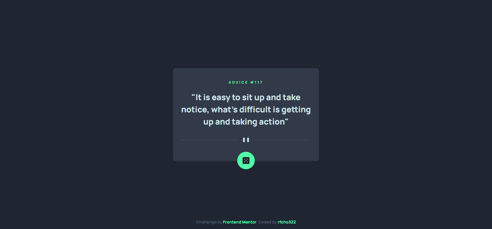
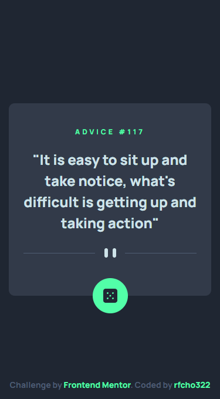

# Frontend Mentor - Advice generator app solution

This is a solution to the [Advice generator app challenge on Frontend Mentor](https://www.frontendmentor.io/challenges/advice-generator-app-QdUG-13db)

## Table of contents

- [Overview](#overview)
  - [The challenge](#the-challenge)
  - [Screenshot](#screenshot)
  - [Links](#links)
- [My process](#my-process)
  - [Built with](#built-with)
  - [Useful resources](#useful-resources)
- [Author](#author)

## Overview

### The challenge

Users should be able to:

- &#9989; View the optimal layout for the app depending on their device's screen size
- &#9989; See hover states for all interactive elements on the page
- &#9989; Generate a new piece of advice by clicking the dice icon

### Screenshot

  <strong>Desktop</strong>

  

  <strong>Mobile</strong>

  

### Links

- Frontend Mentor solution URL: [Advice Generator App Solution]()
- Live Site URL: [Advice Generator App Live Website]()

## My process

### Built with

- Semantic HTML5 markup
- CSS Flexbox
- Mobile-first workflow

### Useful resources

- [Advice Slip JSON API](https://api.adviceslip.com/) - is a free and open API that provides a collection of advice messages in JSON format. It allows developers to easily fetch random advice messages to integrate into their applications or websites

## Author

- Frontend Mentor - [@rfcho322](https://www.frontendmentor.io/profile/rfcho322)

